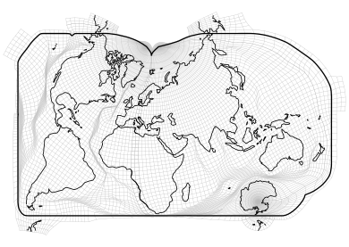

# Elastic Earth projections

 The Elastic Earth projections are map projections of a new breed that uses
 interpolation on a mesh to minimize and control the distortion in maps of the
 whole Earth like never before.

 This repository contains both the data files that define the Elastic Earth projections
 and the source code used to create them.
 If you're interested in making maps using the Elastic Earth projections,
 see [§Using the projections](#Using the projections) below.
 If you're interested in using the code to create new map projections like Elastic Earth,
 see [§Using the code](#Using the code) below that.

## Using the projections

 The map projections are defined, not with equations like most maps are,
 but with tables of coordinates that must be interpolated.
 This section explains how to do that.
 I've coded up two demonstrations for those who learn best by example:
 [a Python implementation](src/elastik.py)
 that uses the HDF files and bilinear interpolation, and
 [a Java implementation](https://github.com/jkunimune/Map-Projections/blob/master/src/maps/Elastik.java)
 that uses the plain text files and Hermite spline interpolation.
 The Java implementation also implements the inverse-projection using Levenberg-Marquardt iteration.

### Map projection structure

 Each Elastic Earth projection can be divided into two to three *sections*.
 Each section covers some portion of the globe and defines the projection for points in that portion.
 Specifically, at a table of points at certain latitudes and longitudes,
 it defines the corresponding x and y values.
 Figure 1 below shows an example of such a point array both in latitude and longitude, and in x and y.
 Note that the points do not completely cover the sphere.
 That's because most latitudes and longitudes are outside of the region this section covers.

 Projecting points within a section is a question of taking latitudes and longitudes not explicitly listed in the table of points,
 and determining the appropriate x and y values based on nearby points that *are* explicitly listed.
 This problem is generally known as 2D interpolation.
 It is a common technique in the computational sciences (as well as in the definition of the Robinson projection),
 and as such you will find many interpolation routines written in every major programming language.
 There are multiple applicable interpolation methods depending on how fancy you want to make it;
 the simplest one is [bilinear interpolation](), but [spline interpolation]() will yield a smoother result.
 Figure 2 below shows the same section as before with geographic data interpolated onto it.
 The shaded region represents the area where interpolation is possible.

 To map the whole globe, we simply combine all of the sections.
 Figure 3 below shows three sections fitting together to form a complete map.

 The astute viewer may note that there is significant overlap between them.
 In addition, some geographic features, such as X, are present on multiple sections in different places.
 Some maps may intentionally use this redundancy.
 For example, it's somewhat common in conventional maps to show the Chukchi peninsula on both
 the left side of the map (where it falls within the international dateline) and
 the right side (where it connects to the rest of Siberia).

 However, in most situations this redundancy is unnecessary and confusing.
 For this reason, each section has a boundary that defines precisely
 which latitudes and longitudes it applies to.
 These boundaries are mutually exclusive,
 so every point on the globe is contained by exactly one (except points exactly on the edge).
 Figure 4 below shows the example section from before with its boundary drawn.

 Thus, to remove the repeated regions, simply check each point before projecting it
 to determine which section contains it,
 and interpolate its x and y using only that section.
 Figure 5 below shows the result of clipping the sections in this way.

 Inverting the map projections is possible but computationally challenging.
 This is a fundamental limitation of mesh-based projection.
 To help with the process, a table of points at certain x and y coordinates is provided ...
 that defines the latitude and longitude that project to it (assuming bilinear interpolation).
 ...

### File format

 The tables are stored in two different formats.

 The first format, which I recommend using, is [HDF](https://www.hdfgroup.org/solutions/hdf5/).
 HDF (hierarchical data format) is a self-describing file format for structured heterogeneous data.
 HDF files can be opened with the program [HDFView](https://www.hdfgroup.org/downloads/hdfview/),
 and are supported by libraries in a variety of programming languages
 including Python, C, Java, and MATLAB.
 Because metadata and hierarchy information is encoded, the contents of a HDF file are fairly intuitive,
 and in principle one can figure out how to use the Elastic Earth HDF files
 without any auxiliary explanation (but I'll explain anyway 😉).

 Each Elastic Earth HDF file contains the following information:
 - The projected boundary of the map projection
 - The bounding x and y values of the map projection
 - The list of section names
 - A group for each section including
   - The latitudes at which the projection is defined
   - The longitudes at which the projection is defined
   - The table of x and y coordinates corresponding to the given latitudes and longitudes (with undefined values set to *NaN*)
   - The boundary on the globe
   - The table of latitudes and longitudes corresponding to the given x and y
   - The minimum and maximum x and y coordinates

 The twoth format is plain text.
 Plain text files can be opened with a variety of programs (Notepad is the default on Windows),
 and can be read natively in any programming language.
 I provide text files because I know HDF might be intimidating for the less technically savvy,
 and because installing HDF can be kind of tricky.
 However, implementing the projections using text files will be more work,
 as you'll need to write code to separate and parse the various numbers and tables.

 Each Elastic Earth plain text file contains the following information, in this order:
 - The number of sections
 - A header for each section followed by
   - The boundary on the globe. Each row is a latitude and the corresponding longitude, in degrees.
   - The table of x and y values corresponding to certain latitudes and longitudes.
     The latitudes and longitudes are not explicitly given;
     the latitudes are evenly spaced between -90° and 90° (inclusive),
     and the longitudes are evenly spaced between -180° and 180° (inclusive).
     Each row corresponds to one latitude, and each pair of columns to one longitude.
     Each pair of adjacent values is an x value followed by the corresponding y value, in kilometers.
     Undefined values are set to *NaN*.
   - The bounding x and y values of the section's inverse raster
   - The table of latitudes and longitudes corresponding to certain x and y values.
     The x and y values are not explicitly given;
     they are evenly spaced between the given bounding values.
     Each row corresponds to one x value and each pair of columns to one y value. TODO: is this true?
     Each pair of adjacent values is a latitude followed by the corresponding longitude, in degrees.
 - The projected boundary of the map projection.
   Each row is an x value followed by the corresponding y value, in kilometers.

## Using the code

 Most of the code is python scripts that you can just run.
 I didn't make a PyPI requirements file because I'm lazy; maybe I'll do that later.
 here are the important scripts:
 - `elastik.py` generates a bunch of nice maps based on pregenerated map projections
 - `create_map_projection.py` generates a map projection based on pregenerated weights and meshes
 - `calculate_weights.py` generates greyscale images that can be used as weights for new map projections (requires coastline data; see below)
 - `build_mesh.py` generates an unoptimized mesh specifying the rough configuration of a new map projection based on a manually specified or pregenerated cut file.
 - `find_drainage_divides.py` generates a cut file based on the borders between watersheds (requires elevation data; see below)
 - `run_all_scripts.py` executes `build_mesh.py`, `calculate_weights.py`, and `create_map_projections.py` in that order on all of their possible inputs

 I've tried to include all dependencies so that PyPI installs and data files are the only things you need to add.
 However, if you want to edit some of the code or run `create_map_projection.py`,
 you'll need to pay attention to the C library, `sparse.c`.
 When I recompile the C library, I go to the root directory in VS Developer Command Prompt and use
 ~~~bash
 cl /D_USR_DLL /D_WINDLL src/sparse.c /link /DLL /OUT:lib/libsparse.dll
 ~~~
 Naturally, if you're not on Windows, it'll be something different.
 Hopefully you can figure it out.  Make sure the command prompt you use
 has the same architecture as the Python distribution you're running!

## Data sources
 I didn't include the geographic data that some of the code is run on because
 some of it is kind of big, and it mite need to be updated periodically in the
 future.

 To run the `calculate_weights.py` script, which computes a map of the distance of
 each point on earth from the nearest shoreline, you will need the coastline and
 land polygon datasets from Natural Earth (naturalearthdata.com).   Download the
 zip files and put them in resources/shapefiles/.  The script will unzip them automatically.
 You specifically need
 - Natural Earth 10m coastline dataset
 - Natural Earth 10m minor islands coastline dataset
 - Natural Earth 110m land dataset

 To run the `find_drainage_divides.py` script, which locates and saves
 continental divides for use as interruptions, you will need the USGS EROS
 Center's global 30 arcsec elevation data set (GTOPO30, DOI: 10.5066/F7DF6PQS).
 Download it as GeoTIF files and put it in resources/elevation/.  The script will load
 and assemble it automatically.
