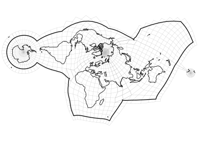

# Elastic projections

The Elastic projections are map projections of a new breed that uses
interpolation on a mesh to minimize and control the distortion in maps of the
whole Earth like never before.

This repository contains both [the data files](projection) that define the Elastic projections and
[the source code](src) used to create them,
as well as [several example maps](examples) that use them.
If you're interested in making maps using the Elastic projections,
see [§ Using the projections](#using-the-projections) below.
If you're interested in using the code to create new map projections like Elastic,
see [§ Using the code](#using-the-code) below that.

## Using the projections

The map projections are defined, not with equations like most maps are,
but with tables of coordinates that must be interpolated.
This section explains how to do that.
The tables are given in two file formats, which can both be found in [`projection/`](projection).
I've coded up two demonstrations for those who learn best by example:
[a Python implementation](src/create_example_maps.py)
that uses the HDF files and bilinear interpolation, and
[a Java implementation](https://github.com/jkunimune/Map-Projections/blob/master/src/maps/Elastic.java)
that uses the plain text files and Hermite spline interpolation.
The Java implementation also implements the inverse-projection using Levenberg-Marquardt iteration.

### Map projection structure

Each Elastic projection can be divided into two to three *sections*.
Each section covers some portion of the globe and defines the projection for points in that portion.
Specifically, each section has a table that, at certain latitudes and longitudes,
defines the corresponding x and y values.
Figure 1 below shows an example of such an array of points both in latitude and longitude, and in x and y.
Note that the points do not completely cover the globe.
That's because most latitudes and longitudes are outside of the region this section covers.

Projecting points within a section is a question of taking latitudes and longitudes not explicitly listed in the table of points,
and determining the appropriate x and y values based on nearby points that *are* explicitly listed.
This problem is generally known as 2D interpolation.
It is a common technique in the computational sciences (as well as in the definition of the Robinson projection),
and as such you will find many interpolation routines written in every major programming language.
There are multiple applicable interpolation methods depending on how fancy you want to make it.
The simplest one is bilinear interpolation, but spline interpolation will yield a smoother result
(though splines will also make inversion harder, if you care about that).
Figure 2 below shows the same section as before with geographic data interpolated onto it.
The shaded region represents the area where interpolation is possible.

To map the whole globe, we simply combine all of the sections.
Figure 3 below shows three sections fitting together to form a complete map.

Note that there is significant overlap between them.
In addition, some geographic features are present on multiple sections in different places,
such as Tierra del Fuego which appears in both the upper left and lower right of the map.
Some maps may intentionally use this redundancy.
For example, it's somewhat common in conventional maps to show the Chukchi peninsula on both
the left side of the map (since it's in the Western Hemisphere) and
the right side (where it connects to the rest of Siberia).

However, in most situations this redundancy is unnecessary and confusing.
For this reason, each section has a boundary that defines precisely
which latitudes and longitudes it applies to.
These boundaries are mutually exclusive,
so every point on the globe is contained by exactly one.
Figure 4 below shows the example section from before with its boundary drawn.

Thus, to remove the repeated regions, simply check each point before projecting it
to determine which section contains it,
and interpolate its x and y using only that section.
Figure 5 below shows the result of clipping the sections in this way.

And there you have it, a world map on an Elastic projection!

Inverting the map projections is possible but computationally challenging.
This is a fundamental limitation of mesh-based projection.
To help with the process, a table is provided that, at certain x and y coordinates,
gives the corresponding latitudes and longitudes (assuming bilinear interpolation).
For x and y coordinates that do not fall on the mesh,
the given latitude and longitude are the ones whose projection is as close as possible.
You can get a pretty good approximation of the inverse-projection by using 2D interpolation on this inverse table,
and then removing all points that fall outside of the map area.

There are two main caveats.
One is that the inverse table cannot completely account for places where two sections of the mesh overlap.
A single set of x and y coordinates in one of those regions
can be projected from multiple sets of latitude and longitude,
but the table only provides one of those sets.
In practice those overlap regions are small enough that it doesn't really matter.
The other caveat is that interpolation is not exact,
so a raster map made using 2D interpolation on the inverse table
will not quite line up with a vector map made using the projection as defined above.
For an exact inverse-projection, apply an iterative solver
like Newton–Raphson, Levenberg–Marquardt, or Nelder–Mead,
using 2D interpolation on the inverse table as the initial guess.

### File format

The tables are stored in two different formats.

The first format, which I recommend using, is [HDF](https://www.hdfgroup.org/solutions/hdf5/).
HDF (hierarchical data format) is a self-describing file format for structured heterogeneous data.
HDF files can be opened with the program [HDFView](https://www.hdfgroup.org/downloads/hdfview/),
and are supported by libraries in a variety of programming languages
including Python, C, Java, and MATLAB.
Because metadata and hierarchy information is encoded, the contents of a HDF file are fairly intuitive,
and in principle one can figure out how to use the Elastic projection HDF files
without any auxiliary explanation.

Each Elastic projection HDF file contains the following information:
- The projected boundary of the map projection.
- The minimum and maximum x and y coordinates of the map projection.
- The list of section names.
- A group for each section including
  - The latitudes at which the projection is defined.
  - The longitudes at which the projection is defined.
  - The table of x and y coordinates corresponding to the given latitudes and longitudes (with undefined values set to *NaN*).
  - The boundary polygon* on the globe.
- A group for the inverse table including
  - The x values at which the inverse-projection is defined.
  - The y values at which the inverse-projection is defined.
  - The table of latitudes and longitudes corresponding to the given x and y values (values that don't fall on the mesh).

The twoth format is plain text.
Plain text files can be opened with a variety of programs (Notepad is the default on Windows),
and can be read natively in any programming language.
I provide text files because I know HDF can be intimidating for the less technically savvy,
and because installing HDF can be kind of tricky.
However, implementing the projections using text files will be more work,
as you'll need to write code to separate and parse the various numbers and tables.

Each Elastic projection plain text file contains the following components, in this order:
- A header for the map projection, stating the number of sections.
- A header for each section followed by
  - A header for the section's boundary polygon* on the globe, stating the number of vertices in the boundary, followed by
    - The list of vertices in the boundary.
      Each row is a latitude and the corresponding longitude, in degrees.
  - A header for the table of x and y values, stating the number of rows and columns in the table, followed by
    - The table of x and y values corresponding to certain latitudes and longitudes.
      Each row corresponds to one latitude, and each pair of columns to one longitude.
      Each pair of adjacent values is an x value followed by the corresponding y value, in kilometers.
      Undefined values are set to *NaN*.
      The latitudes and longitudes are not explicitly given;
      the latitudes are evenly spaced between -90° and 90° (inclusive),
      and the longitudes are evenly spaced between -180° and 180° (inclusive).
- A header for the map projection's projected boundary, stating the number of vertices in the boundary, followed by
  - The list of vertices in the projected boundary.
    Each row is an x value followed by the corresponding y value, in kilometers.
- A header for the inverse table, stating the number of rows and columns in the table, followed by
  - The minimum x value of the inverse table, the minimum y value of the inverse table,
    the maximum x value of the inverse table, and the maximum y value of the inverse table, in kilometers.
  - The table of latitudes and longitudes corresponding to certain x and y values.
    Each row corresponds to one x value and each pair of columns to one y value.
    Each pair of adjacent values is a latitude followed by the corresponding longitude, in degrees.
    The x and y values are not explicitly given;
    they are evenly spaced between the given minimums and maximums.

* In both file formats, the boundary polygons are directional.
This means that, while most of them have vertices that go counterclockwise,
some of them have vertices that go clockwise, and for these ones the section covers everything *outside* of the polygon.
In other words, if you imagine travelling along the boundary polygon's edge,
the region included in the section is always on the left, and the region excluded from the region is always on the right.

## Using the code

Most of the code is Python scripts that you can just run.
All can be found in [`src/`](src/).
Here are the important ones:
- `create_example_maps.py` generates a bunch of nice maps (see [`examples/`](examples) based on pregenerated map projections.
- `create_map_projection.py` generates a map projection based on pregenerated weights and meshes.
- `calculate_weights.py` generates grayscale images that can be used as weights for new map projections (requires coastline data; see below).
- `build_mesh.py` generates an unoptimized mesh specifying the rough configuration of a new map projection based on a manually specified or pregenerated cut file.
- `find_drainage_divides.py` generates a cut file based on the boundaries between watersheds (requires elevation data; see below).
- `run_all_scripts.py` executes `build_mesh.py`, `calculate_weights.py`, `create_map_projections.py`, and `create_example_maps.py` in that order on all of their possible inputs.

If you want to make alterations to the map projections, you can do so using the options files in [`resources/`](resources).
Each one identifies a cuts file (either written by hand or generated by `find_drainage_divides.py`),
a pair of weights files generated by `calculate_weights.py`, and a maximum bounding box size.

### Dependencies

Some of these scripts have PyPI dependencies, which are enumerated in `requirements.txt`.
You'll also likely need to pay attention to the C library, `sparse.c`.
A compiled DLL file is included in this repository,
but depending on your system you'll likely need to recompile it yourself.
I do this by going to the root directory in VS Developer Command Prompt and using
~~~bash
cl /D_USR_DLL /D_WINDLL src/sparse.c /link /DLL /OUT:lib/libsparse.dll
~~~
Naturally, if you're not on Windows, it'll be something different.
Hopefully you can figure it out.  Make sure the command prompt you use
has the same architecture as the Python distribution you're running!

### Data sources

I didn't include the geographic data that some of the code depends on because
some of it is kind of big, and it might need to be updated in the
future.

To run the `calculate_weights.py` script, you will need some coastline and
land polygon datasets from Natural Earth ([naturalearthdata.com](https://www.naturalearthdata.com)).
Download the zip files and put them in `resources/shapefiles/`. 
The script will unzip them automatically.
You specifically need
- Natural Earth 10m coastline dataset
- Natural Earth 10m minor islands coastline dataset
- Natural Earth 110m land dataset

To run the `find_drainage_divides.py` script,
you will need the USGS EROS Center's global 30 arcsec elevation dataset
(GTOPO30, DOI: [10.5066/F7DF6PQS](https://doi.org/10.5066/F7DF6PQS)).
Download it from [EarthExplorer](https://earthexplorer.usgs.gov/) as GeoTIF files
and put them in `resources/elevation/`.
The script will load and assemble it automatically.
You will also need the Natural Earth 10m rivers with lake centerlines dataset
([naturalearthdata.com](https://www.naturalearthdata.com/downloads/10m-physical-vectors/10m-rivers-lake-centerlines/)).
Download it as a zip file and put it in `resources/shapefiles/`.

To run the `elastic.py` script,
you will need the World Wildlife Fund's terrestrial ecoregions of the world dataset
([worldwildlife.org](https://www.worldwildlife.org/publications/terrestrial-ecoregions-of-the-world)).
Download the zip file and put it in `resources/shapefiles/`.
You will also need several datasets from Natural Earth (naturalearthdata.com).
Download them as zip files and put them in `resources/shapefiles/`.
- Natural Earth 10m bathymetry A–K datasets
- Natural Earth 50m coastline dataset
- Natural Earth 50m rivers with lake centerlines dataset with scale ranks and tapering
- Natural Earth 50m ocean dataset
- Natural Earth 110m admin 0 countries dataset
- Natural Earth 110m lakes dataset

## References

These projections are closely based on the Danseiji map projections I previously published: J. Kunimune, "Minimum-error world map projections defined by polydimensional meshes", _International Journal of Cartography_ **6**.1 (2021), p. 78–99, DOI: [10.1080/23729333.2020.1824174](https://doi.org/10.1080/23729333.2020.1824174).

The coastlines used for the mesh and distortion maps, as well as the rivers and borders used for [water.png](examples/water.png), [political.png](examples/political.png), and [human migration.svg](<examples/human migration.svg>) are taken from [Natural Earth](https://www.naturalearthdata.com/).

The ecoregion boundaries used for [biomes.png](examples/biomes.png) are taken from the [World Wildlife Fund's](https://www.worldwildlife.org/) TEOW dataset: D. M. Olson, E. Dinerstein, E. D. Wikramanayake, and al., "Terrestrial ecoregions of the world: a new map of life on Earth", _Bioscience_ **51**.11 (2001), p. 933–938, DOI: [10.1641/0006-3568(2001)051\[0933:TEOTWA\]2.0.CO;2](https://doi.org/10.1641/0006-3568\(2001\)051[0933:TEOTWA]2.0.CO;2).

The chlorophyll concentration data used for [chlorophyll.png](examples/chlorophyll.png) is taken from [NOAA CoastWatch's](https://coastwatch.noaa.gov/cwn/index.html) Chlorophyll-a Gap-filled DINEOF 9km dataset.  The Northern Hemisphere uses the data for 2023 Jun 21, the Southern Hemisphere uses the data for 2023 Dec 21, and the band between 15°S and 15°N is a blend between the two.  I downloaded their NC (HDF?) files using their [Data Portal](https://coastwatch.noaa.gov/cw_html/cwViewer.html).
The driving direction data used for [driving direction.svg](<examples/driving direction.svg>) is copied off of the 2020 May version of [Countries driving on the left or right.svg](https://commons.wikimedia.org/wiki/File:Countries_driving_on_the_left_or_right.svg), published by Benjamin D. Esham on the Wikimedia Commons.

The human migration routes used for [human migration.svg](<examples/human migration.svg>) is copied off of the 2023 October version of [Early migrations mercator.svg](https://commons.wikimedia.org/wiki/File:Early_migrations_mercator.svg), published by D. Bachmann on the Wikimedia Commons. That map is based on collated information from the Wikipedia article [Early human migrations](https://en.wikipedia.org/wiki/Early_human_migrations), and from the article M. Metspalu, T. Kivisild, E. Metspalu, and al., "Most of the extant mtDNA boundaries in south and southwest Asia were likely shaped during the initial settlement of Eurasia by anatomically modern humans", _BioMed Central Genomics_ **5** (2004), article 26, DOI: [10.1186/1471-2156-5-26](https://doi.org/10.1186/1471-2156-5-26).  The grey regions around the continents represent the coastlines assuming a sea level 125 m below what it is today (during the last glacial maximum), calculated using [General Bathymetric Chart of the Oceans's](https://www.gebco.net/) 2023 gridded bathymetry data.
